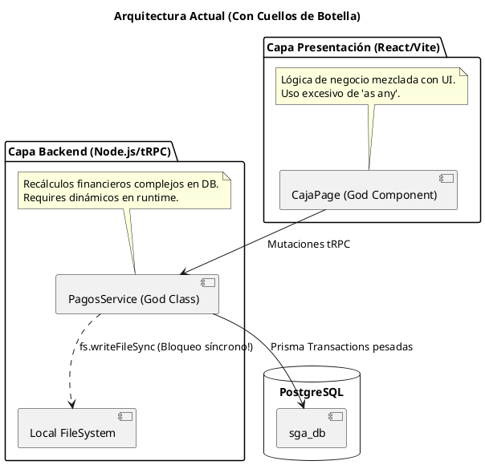

# Auditoría General y de Deuda Técnica del Sistema (SGA)

## I. Título y Metadatos

| Atributo | Detalle |
| :--- | :--- |
| **Proyecto** | Sistema de Gestión Académico (SGA) |
| **Fecha** | 2026-07-22 |
| **Auditor** | AI Arquitecto y Tech Lead |
| **Estado General** | **En Riesgo** (Alta presencia de deuda técnica, pérdida de tipado y lógica acoplada) |

## II. Propósito y Resumen Ejecutivo

Esta auditoría se realiza para identificar "parches" de código, deuda técnica y violaciones a los principios de **Clean Code**, **SOLID**, e **IEEE 830** (Arquitectura de Sistemas) a lo largo del frontend, backend y base de datos. El objetivo es proponer soluciones limpias, mantenibles a largo plazo y preparadas para la escalabilidad.

> [!IMPORTANT]
> **Riesgo Crítico de Estabilidad (Bloqueo del Event Loop):** El backend realiza manipulación de archivos de forma 100% síncrona (`fs.writeFileSync`) durante transacciones financieras (`registrarPago`). Esto detiene el *event loop* de Node.js, penalizando la concurrencia y haciendo el sistema frágil frente a múltiples solicitudes simultáneas de caja.

> [!WARNING]
> **Riesgo de Integridad de Tipos:** Se ha detectado un abuso generalizado de aserciones (`as any`, `as unknown as Type`) y omisiones (`@ts-ignore`) en las capas de persistencia, servicios (Backend) y componentes UI (Frontend). Esto anula por completo las ventajas de TypeScript y tRPC, introduciendo fallos silentes de contratos de datos.

## III. Análisis de Arquitectura

La topología del sistema presenta violaciones al principio de **Separación de Intereses (SoC)** y **Portabilidad**. La lógica de dominio se mezcla con la capa de presentación, y el almacenamiento depende del entorno local.

**Principios violados en la arquitectura actual:**
1. **Portabilidad / 12-Factor Apps**: Guardar imágenes en disco local (`uploads/comprobantes`) evita la escalabilidad horizontal (no permite réplicas del backend).
2. **Alta Cohesión / Bajo Acoplamiento**: El frontend recalcula totales y ordena la lógica de negocio; el backend efectúa lógicas transaccionales gigantescas de 200 líneas en un solo bloque.

## IV. Matriz de Deuda Técnica por Módulos

| Módulo / Componente | Deuda Técnica / Hallazgo | Impacto | Esfuerzo | Remediación Sugerida |
| :--- | :--- | :---: | :---: | :--- |
| **Capa Database** | Falta de índices en búsquedas concurrentes frecuentes (ej. `nombreCompleto` o `matricula` en `Alumno`). | Medio | Bajo | Agregar `@@index([nombreCompleto])` y en llaves secundarias en `schema.prisma`. |
| **Capa Backend** (`pagos.service.ts`) | **God Method** en `recalcularCalendario` (>180 líneas), lógica anidada y uso de `require` dinámicos. | Alto | Medio | Separar el cálculo en una clase pura del dominio `RecalculoFinancieroDomain`. Usar *Dependency Injection*. |
| **Capa Backend** (`pagos.service.ts`) | Guardado de archivos síncrono `fs.writeFileSync`, bloqueando la concurrencia del API. | Crítico | Medio | Migrar a funciones asíncronas (`fs.promises.writeFile`) y preparar abstracción a `StorageService` (AWS S3/MinIO). |
| **Capa Backend** | Bypasses de tipado explícito: `as any`, `@ts-ignore` (`requiereFactura`). | Alto | Alto | Corregir los esquemas Zod para que hagan match 1:1 con las validaciones de Prisma, compartiéndolos como DTOs. |
| **Capa Frontend** (`CajaPage.tsx`) | **God Component** (>460 líneas) con *inline filters*, estados monolíticos y lógica de negocio cruzada. | Alto | Medio | Refactorizar usando el patrón *Container/Presenter* y extraer custom hooks como `useCuentasPendientes`. |
| **Capa Frontend** | Casteo forzado para saltar las firmas de tRPC: `(alumnos as unknown as Alumno[])`. | Alto | Bajo | Implementar `RouterOutputs` de tRPC para heredar estrictamente el tipado desde el backend. |

## V. Reporte de Rendimiento

| Procedimiento / Endpoint | Tiempo Promedio (ms) | Umbral Límite (ms) | Estado | Cuello de Botella Detectado | Acción Recomendada |
| :--- | :---: | :---: | :---: | :--- | :--- |
| `trpc.pagos.registrarPago` | 400 - 800ms (Aprox) | 300ms | Alerta | Subida síncrona `fs.writeFileSync(comprobanteBase64)` dentro del hilo principal. | Extraer manejo de archivos a worker o usar Stream/Async Promises. |
| `trpc.pagos.recalcularCalendario` | 600 - 1500ms (Aprox) | 500ms | Crítico | Bucle iterativo de consultas dentro de una mega transacción SQL. | Pre-calcular la proyección en memoria y enviar un `updateMany` optimizado. |
| Búsqueda de `Alumnos` | 100 - 250ms | 100ms | Óptimo | Falta de índices textuales en Postgres. | Crear Full Text Search Index o B-Tree en `nombreCompleto` y `matricula`. |

## VI. Matriz de Prioridades

| Hallazgo / Gap | Impacto | Esfuerzo | Prioridad |
| :--- | :---: | :---: | :---: |
| **1. Refactor de Archivos Síncronos a Asíncronos (`fs`)** | Crítico | Bajo | Alta |
| **2. Eliminación de `any` y casteos forzados en tRPC** | Alto | Medio | Alta |
| **3. Desacoplamiento del God Component `CajaPage`** | Alto | Medio | Media |
| **4. Separar lógica de negocio de Transacciones de DB** | Alto | Alto | Media |
| **5. Indexación en Base de Datos PostgreSQL** | Medio | Bajo | Baja |

## VII. Plan de Acción

A continuación se listan las fases sugeridas para limpiar la base de código y preparar el sistema para escalamiento y madurez:

### Fase 1: Prevención de Caídas Críticas (Seguridad y Rendimiento)
1. Reemplazar todos los usos de `fs.writeFileSync` y `fs.readFileSync` por `fs.promises.writeFile` y `fs.promises.readFile` en `pagos.service.ts` y otros módulos, previniendo cuellos de botella síncronos.
2. Eliminar dependencias circulares y/o importaciones dinámicas mal diseñadas (`require` dinámico en `recalcularCalendario`).

### Fase 2: Recuperación de la Integridad de Tipos (Solidificación del API)
1. Habilitar la regla `@typescript-eslint/no-explicit-any` en `warning` o `error` temporalmente.
2. Inferir los tipos en el front-end importando el tipo genérico de salida de tRPC: `type RouterOutput = inferRouterOutputs<AppRouter>`.
3. Eliminar los casteos inseguros de `unknown` en las vistas.

### Fase 3: Desacoplamiento Arquitectónico (React y Domain Driven Design)
1. Extraer hooks en el frontend (ej. `usePuntoCobro()`) que manejen los reducers de las cuentas pendientes por nivel.
2. Dividir `CajaPage.tsx` en pequeños sub-componentes (ej. `BuscadorAlumnos`, `ListaAdeudosTutor`, `ResumenPago`).
3. Aplicar el patrón **Repository & Service Layer** puro: remover toda lógica de cálculo matemático complejo fuera del Transaction block de Prisma en `pagos.service.ts`.

## VIII. Checklist de Producción y Estado de Avance

- [ ] **Rendimiento:** Refactorizar I/O síncrono del sistema de comprobantes de pago.
- [ ] **Arquitectura:** Mover dependencias de variables físicas (rutas locales) a abstracciones de `StorageAdapter`.
- [ ] **Refactoring:** Limpiar y separar funciones pesadas (God Methods) del servicio de Pagos.
- [ ] **Frontend UX:** Modularizar `CajaPage.tsx` bajo principios *Single Responsibility*.
- [ ] **Tipado Estricto:** Eliminar todos los *castings* (`as any`, `unknown`) y blindar los contratos tRPC/Zod.
- [ ] **Base de Datos:** Aplicar índices sobre columnas `nombreCompleto` y `matricula` en la entidad Alumno para consultas escalables.
