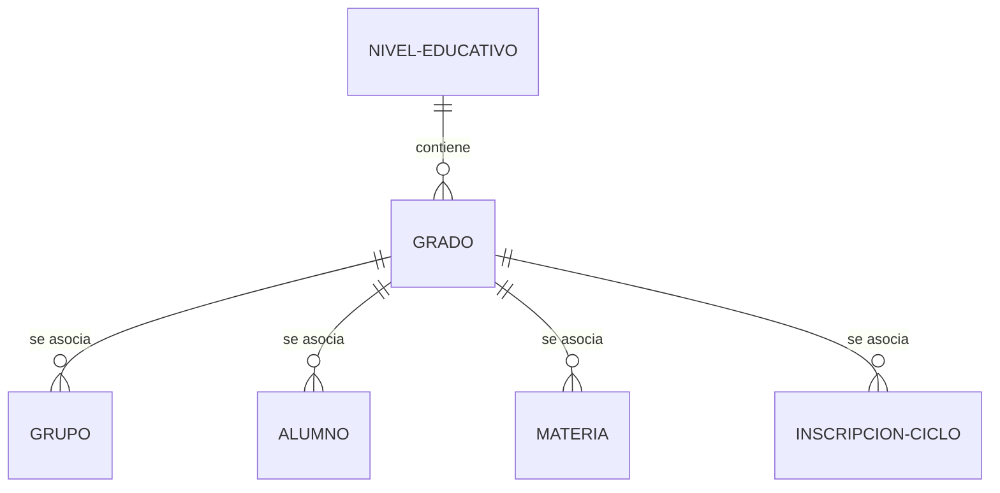

# Reporte de Ingeniería Inversa: Integración del Modelo "Grado" y Ajustes del Entorno

Este documento detalla el análisis de ingeniería inversa realizado sobre los cambios recientes en el **Sistema de Gestión Académico (SGA)**, abarcando desde el esquema de base de datos hasta la interfaz de usuario en el frontend y la automatización del entorno local.

---

## 1. Estructura y Capa de Datos (Prisma & PostgreSQL)

### Modelo de Base de Datos
Se introdujo una nueva entidad `Grado` para representar los niveles de curso específicos dentro de cada nivel educativo (por ejemplo, "1º Grado", "2º Grado", etc.).



#### Cambios en [schema.prisma](file:///c:/Users/josem/Documents/San_Diego/sga/packages/data-access/prisma/schema.prisma):
*   **Nueva Entidad `Grado`:**
    *   `gradoId` (Int, Autoincrement, PK)
    *   `nivelId` (Int, FK a `NivelEducativo`)
    *   `numero` (Int, número de orden del grado)
    *   `nombre` (VarChar(50), nombre descriptivo)
    *   Tiempos de auditoría: `creadoEn`, `actualizadoEn`, `eliminadoEn` (con soporte para borrado lógico).
*   **Nuevas Relaciones y Modificaciones de Cascada:**
    *   `NivelEducativo` -> `Grado` (Relación Uno a Muchos).
    *   `Grupo` -> `Grado` (Obligatorio, con FK `gradoId`). Se actualizaron las relaciones de `nivel` y `ciclo` a `onDelete: NoAction` para prevenir ciclos de eliminación.
    *   `Materia` -> `Grado` (Opcional, con FK `gradoId`, comportamiento `onDelete: SetNull`).
    *   `Alumno` -> `Grado` (Opcional, con FK `gradoId`, comportamiento `onDelete: SetNull`).
    *   `InscripcionCiclo` -> `Grado` (Opcional, con FK `gradoId`, comportamiento `onDelete: NoAction`).

### Migración de Base de Datos (`20260707163000_add_grado_model`)
Ubicación: [migration.sql](file:///c:/Users/josem/Documents/San_Diego/sga/packages/data-access/prisma/migrations/20260707163000_add_grado_model/migration.sql)

La migración maneja de forma segura datos preexistentes:
1.  Crea la tabla `grado` y sus restricciones iniciales.
2.  **Migración de Datos Semilla:** Inserta automáticamente un registro de grado `"1º Grado"` con `numero: 1` para cada `nivel_educativo` existente en la base de datos.
3.  **Actualización de Grupos Existentes:** Agrega la columna `grado_id` temporalmente como nullable, asocia todos los grupos existentes al primer grado creado para su respectivo nivel educativo y luego aplica la restricción `NOT NULL`.
4.  Agrega columnas `grado_id` a `alumno`, `inscripcion_ciclo` y `materia`.
5.  Aplica las llaves foráneas correspondientes con las reglas de cascada definidas en el esquema de Prisma.

---

## 2. Capa de Backend (Fastify, tRPC, Zod & Repositorio)

### Repositorio (`GruposRepository`)
Ubicación: [grupos.repository.ts](file:///c:/Users/josem/Documents/San_Diego/sga/packages/back-end/src/modules/grupos/grupos.repository.ts)
*   **CRUD de Grados:**
    *   `getGrados()`: Obtiene todos los grados activos (`eliminadoEn: null`) ordenados ascendentemente por su `numero`.
    *   `createGrado(data)`: Inserta un nuevo grado.
    *   `updateGrado(gradoId, data)`: Modifica un grado existente.
    *   `deleteGrado(gradoId)`: Realiza un borrado lógico estableciendo la propiedad `eliminadoEn` a la fecha actual.
*   **Carga de Relaciones:**
    *   Se modificó la consulta `getGrupos` para incluir la relación `grado` de forma eager en el resultado devuelto.

### Reglas de Negocio y Validación en el Servicio (`GruposService`)
Ubicación: [grupos.service.ts](file:///c:/Users/josem/Documents/San_Diego/sga/packages/back-end/src/modules/grupos/grupos.service.ts)
*   Se implementó la lógica de validación para **evitar borrados inválidos (Integridad Referencial lógica)**:
    *   Un grado no puede ser eliminado si tiene **grupos** activos asociados.
    *   Un grado no puede ser eliminado si tiene **alumnos** activos asociados.
    *   Un grado no puede ser eliminado si tiene **materias** activas asociadas.
    *   En cualquiera de estos casos, se lanza un `TRPCError` con código `BAD_REQUEST` y un mensaje de error descriptivo.
*   `updateGrado` actualiza automáticamente el campo `actualizadoEn`.

### Validación de Entrada (Zod Schemas)
Ubicación: [grupos.schema.ts](file:///c:/Users/josem/Documents/San_Diego/sga/packages/back-end/src/modules/grupos/grupos.schema.ts)
*   Se crearon `createGradoSchema` y `updateGradoSchema` para validar la estructura de los datos del grado.
*   Se actualizó `createMateriaSchema` para permitir `gradoId` opcional y nullable.
*   Se actualizó `createGrupoSchema` para requerir obligatoriamente un `gradoId` entero positivo.

### Rutas de la API (tRPC Router)
Ubicación: [grupos.router.ts](file:///c:/Users/josem/Documents/San_Diego/sga/packages/back-end/src/modules/grupos/grupos.router.ts)
*   Se expuso el query `getGrados` accesible para roles de tipo docente (`docentProcedure`).
*   Se expusieron las mutaciones `createGrado`, `updateGrado` y `deleteGrado` restringidas a roles de administración/gestión (`gestorProcedure`).

---

## 3. Pruebas Unitarias

Ubicación: [grupos.service.test.ts](file:///c:/Users/josem/Documents/San_Diego/sga/packages/back-end/src/modules/grupos/grupos.service.test.ts)

Se agregaron pruebas exhaustivas para asegurar el comportamiento correcto del servicio:
1.  **Lectura y Creación:** Verificación de consulta y creación exitosa de grados contra mocks de Prisma.
2.  **Actualización:** Comprobación de que los datos modificados se envían correctamente a la base de datos con la marca de tiempo actualizada.
3.  **Integridad al Eliminar (Negativo):** Tres pruebas separadas que simulan la existencia de dependencias (grupos, alumnos o materias) y validan que el servicio arroje los errores correspondientes de forma controlada.
4.  **Eliminación Exitosa (Positivo):** Verificación de que el borrado lógico se ejecuta marcando `eliminadoEn` si no hay dependencias.
5.  **Inclusión en Consultas:** Verificación de que las búsquedas de grupos ahora contienen la relación eager de grado.

---

## 4. Capa de Frontend (React & Formulario de Grupos)

Ubicación: [GrupoFormModal.tsx](file:///c:/Users/josem/Documents/San_Diego/sga/packages/front/src/modules/grupos/components/GrupoFormModal/GrupoFormModal.tsx)

Se integró el nuevo campo de Grado en el modal de creación y edición de grupos con las siguientes características:
*   **Validación de Formulario:** Se añadió la regla `gradoId` requerida al esquema Zod del formulario.
*   **Carga de Opciones:** Se ejecuta la query `getGrados` de tRPC de forma perezosa al abrir el modal.
*   **Comportamiento en Cascada (Cascading Select):**
    *   Se observa (`watch`) el valor seleccionado de `nivelId`.
    *   Se filtran dinámicamente los grados de modo que solo se muestren aquellos cuyo `nivelId` coincide con el nivel educativo seleccionado:
        ```typescript
        const selectedNivelId = watch('nivelId');
        const filteredGrados = selectedNivelId
          ? grados?.filter(g => String(g.nivelId) === selectedNivelId)
          : grados;
        ```
    *   El select de Grado se mantiene deshabilitado hasta que el usuario elija un nivel educativo, mostrando la leyenda explicativa *"Selecciona primero un nivel..."*.
*   **Edición y Envío:** Mapea el valor de `gradoId` desde y hacia los valores del formulario convirtiéndolo adecuadamente a entero para la mutación.

---

## 5. Automatización y Entorno Local

Ubicación: [package.json](file:///c:/Users/josem/Documents/San_Diego/sga/package.json) y [packages/data-access/package.json](file:///c:/Users/josem/Documents/San_Diego/sga/packages/data-access/package.json)

Para resolver el problema del bloqueo `EPERM` en Windows al ejecutar comandos de Prisma (debido a que los procesos del backend retienen el binario dll de consulta), se implementó un script de liberación de puerto:
*   Al ejecutar `db:generate` o `db:migrate`, se ejecuta un comando de PowerShell que busca el proceso escuchando en el puerto del backend (`3001`) y lo mata de forma forzada antes de que Prisma intente re-escribir el query engine:
    ```powershell
    powershell -Command "Get-NetTCPConnection -LocalPort 3001 -ErrorAction SilentlyContinue | ForEach-Object { Stop-Process -Id $_.OwningProcess -Force -ErrorAction SilentlyContinue }; exit 0"
    ```
*   Esto previene fallos aleatorios en los scripts del entorno local de desarrollo.
